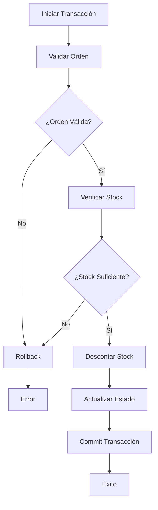
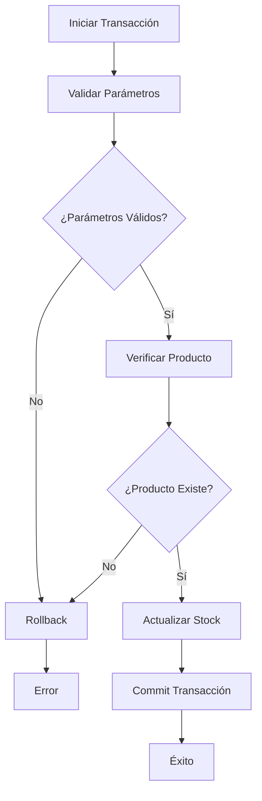

# 🛡️ Validaciones de Negocio - Sistema de Gestión de Inventario

## 📋 Resumen

Este documento describe el sistema robusto de validaciones de negocio implementado en el Sistema de Gestión de Inventario. Las validaciones garantizan la integridad de datos y previenen operaciones que violen las reglas críticas del negocio.

## 🎯 Reglas Críticas Implementadas

### 1. 🗄️ Stock Nunca Negativo
- **Regla**: La cantidad de stock nunca puede ser negativa
- **Validación**: Se verifica en todas las operaciones de stock
- **Implementación**: `StockValidator.validate_quantity()`

### 2. 🛒 Ventas No Pueden Superar Stock
- **Regla**: No se pueden crear órdenes con cantidades mayores al stock disponible
- **Validación**: Se verifica al crear órdenes y al completarlas
- **Implementación**: `OrderValidator.validate_order_creation()`

### 3. 🔄 Operaciones Transaccionales
- **Regla**: Completar órdenes es una operación atómica (commit/rollback)
- **Validación**: Rollback automático si falla cualquier validación
- **Implementación**: `TransactionManager.execute_order_completion()`

## 🏗️ Arquitectura del Sistema

### 📁 Estructura de Archivos

```
app/
├── validators/
│   └── business_rules.py          # Validaciones centralizadas
├── routes/
│   ├── orders.py                  # Rutas con validaciones de órdenes
│   └── stock.py                   # Rutas con validaciones de stock
└── models/                        # Modelos de datos
    ├── stock.py
    ├── order.py
    └── order_item.py

tests/
├── test_business_rules.py         # Tests exhaustivos
├── conftest.py                    # Configuración de pytest
└── fixtures/                      # Datos de prueba

demo_business_rules.py             # Script de demostración
```

### 🔧 Componentes Principales

#### 1. **BusinessRuleViolation**
Excepción personalizada para violaciones de reglas de negocio:
```python
class BusinessRuleViolation(Exception):
    def __init__(self, message: str, field: str = None, value: Any = None):
        self.message = message
        self.field = field
        self.value = value
```

#### 2. **StockValidator**
Validador de reglas de negocio para stock:
- `validate_quantity()` - Cantidades no-negativas
- `validate_min_stock()` - Stock mínimo válido
- `check_stock_availability()` - Verificar disponibilidad

#### 3. **OrderValidator**
Validador de reglas de negocio para órdenes:
- `validate_order_items()` - Estructura de items
- `validate_order_creation()` - Creación de órdenes
- `validate_order_completion()` - Completación de órdenes

#### 4. **TransactionManager**
Gestor de transacciones para operaciones críticas:
- `execute_order_completion()` - Completar orden con rollback
- `execute_stock_update()` - Actualizar stock con validaciones

#### 5. **BusinessRuleEngine**
Motor principal de validaciones:
- `validate_all_business_rules()` - Validar todo el sistema

## 🧪 Tests Implementados

### 📊 Cobertura de Tests

Los tests cubren todos los casos críticos:

#### **StockValidator Tests**
- ✅ Cantidades positivas válidas
- ❌ Cantidades negativas rechazadas
- ❌ Tipos inválidos rechazados
- ✅ Stock mínimo válido
- ❌ Stock mínimo negativo rechazado

#### **OrderValidator Tests**
- ✅ Items de orden válidos
- ❌ Orden vacía rechazada
- ❌ Campos faltantes rechazados
- ❌ Cantidades inválidas rechazadas
- ✅ Creación de orden válida
- ❌ Stock insuficiente rechazado

#### **TransactionManager Tests**
- ✅ Actualización de stock válida
- ❌ Stock negativo rechazado
- ✅ Completación de orden válida
- ❌ Orden con stock insuficiente rechazada
- ✅ Rollback automático en errores

#### **BusinessRuleEngine Tests**
- ✅ Validación con datos válidos
- ❌ Detección de stock negativo
- ❌ Detección de stock mínimo inválido
- ❌ Detección de productos duplicados

#### **Integration Tests**
- ✅ API endpoints con validaciones
- ✅ Flujo completo de creación y completación
- ✅ Manejo de errores HTTP apropiado

### 🚀 Ejecutar Tests

```bash
# Ejecutar todos los tests de validaciones
pytest tests/test_business_rules.py -v

# Ejecutar tests específicos
pytest tests/test_business_rules.py::TestStockValidator -v
pytest tests/test_business_rules.py::TestOrderValidator -v
pytest tests/test_business_rules.py::TestTransactionManager -v

# Ejecutar con coverage
pytest tests/test_business_rules.py --cov=app.validators --cov-report=html
```

## 🌐 Endpoints de API con Validaciones

### 📦 Stock Management

#### **PUT /api/stock/{product_id}**
Actualizar stock con validaciones:
```json
{
  "quantity": 15,
  "min_stock": 5
}
```
**Validaciones:**
- ❌ Cantidad no puede ser negativa
- ❌ Stock mínimo no puede ser negativo
- ✅ Rollback automático en errores

#### **POST /api/stock/{product_id}/adjust**
Ajustar stock (incrementar/decrementar):
```json
{
  "adjustment": -5,
  "reason": "Ajuste manual"
}
```
**Validaciones:**
- ❌ Ajuste no puede resultar en stock negativo
- ✅ Rollback automático en errores

#### **GET /api/stock/validate**
Validar todas las reglas de stock:
```json
{
  "valid": true,
  "violations": [],
  "total_checks": 4
}
```

### 🛒 Order Management

#### **POST /api/orders/**
Crear orden con validaciones:
```json
{
  "items": [
    {
      "product_id": 1,
      "quantity": 5
    }
  ]
}
```
**Validaciones:**
- ❌ Stock insuficiente rechazado
- ❌ Producto inexistente rechazado
- ❌ Cantidades inválidas rechazadas
- ✅ Rollback automático en errores

#### **PUT /api/orders/{id}/complete**
Completar orden con validaciones:
```json
{
  "success": true,
  "message": "Orden 1 completada exitosamente",
  "stock_updated": 1
}
```
**Validaciones:**
- ❌ Solo órdenes pendientes
- ❌ Stock insuficiente rechazado
- ✅ Operación transaccional completa
- ✅ Rollback automático en errores

## 🔄 Flujo de Transacciones

### 📋 Completar Orden



### 🗄️ Actualizar Stock



## 🚨 Casos de Error y Rollback

### ❌ Stock Negativo
```python
# Intento de actualizar stock a valor negativo
try:
    TransactionManager.execute_stock_update(product_id=1, new_quantity=-5)
except BusinessRuleViolation as e:
    # Rollback automático - base de datos no modificada
    print(f"Error: {e.message}")
```

### ❌ Stock Insuficiente
```python
# Intento de completar orden con stock insuficiente
try:
    TransactionManager.execute_order_completion(order_id=1)
except BusinessRuleViolation as e:
    # Rollback automático - orden no completada, stock no modificado
    print(f"Error: {e.message}")
```

### ❌ Orden Inválida
```python
# Intento de crear orden con datos inválidos
try:
    OrderValidator.validate_order_creation([
        {'product_id': 1, 'quantity': -5}  # Cantidad negativa
    ])
except BusinessRuleViolation as e:
    print(f"Error: {e.message}")
    print(f"Campo: {e.field}")
    print(f"Valor: {e.value}")
```

## 🎯 Casos de Uso Cubiertos

### ✅ Casos Válidos
- **Stock positivo**: Cantidades 0 o mayores
- **Órdenes válidas**: Stock suficiente, productos existentes
- **Completación exitosa**: Stock disponible, orden pendiente
- **Actualizaciones válidas**: Parámetros correctos

### ❌ Casos Rechazados
- **Stock negativo**: Cantidades menores a 0
- **Stock insuficiente**: Órdenes que exceden disponibilidad
- **Órdenes inválidas**: Campos faltantes, tipos incorrectos
- **Completación inválida**: Estados incorrectos, stock insuficiente

### 🔄 Casos de Rollback
- **Error en validación**: Rollback antes de modificar BD
- **Error en transacción**: Rollback completo de operación
- **Stock insuficiente**: Rollback de descuento de stock
- **Producto inexistente**: Rollback de creación de orden

## 🚀 Uso y Ejemplos

### 🔧 Configuración

```python
from app.validators.business_rules import (
    StockValidator,
    OrderValidator,
    TransactionManager,
    BusinessRuleEngine
)
```

### 📊 Validar Stock

```python
# Validar cantidad
StockValidator.validate_quantity(10)  # ✅ Válido
StockValidator.validate_quantity(-5)  # ❌ Error

# Verificar disponibilidad
available, current = StockValidator.check_stock_availability(1, 5)
if available:
    print(f"Stock disponible: {current}")
else:
    print(f"Stock insuficiente. Disponible: {current}")
```

### 🛒 Validar Órdenes

```python
# Validar items
items = [{'product_id': 1, 'quantity': 5}]
OrderValidator.validate_order_creation(items)  # ✅ Válido

# Validar completación
order, stock_updates = OrderValidator.validate_order_completion(1)
```

### 🔄 Gestión de Transacciones

```python
# Completar orden
result = TransactionManager.execute_order_completion(order_id=1)
if result['success']:
    print(f"Orden completada: {result['message']}")
    print(f"Stock actualizado: {result['stock_updated']} productos")

# Actualizar stock
result = TransactionManager.execute_stock_update(
    product_id=1,
    new_quantity=15
)
```

### 🎯 Validación del Sistema

```python
# Validar todas las reglas
result = BusinessRuleEngine.validate_all_business_rules()
if result['valid']:
    print("✅ Sistema válido")
else:
    print(f"❌ {len(result['violations'])} violaciones encontradas")
    for violation in result['violations']:
        print(f"   - {violation['message']}")
```

## 🧪 Demo Interactivo

Ejecuta el script de demostración para ver todas las validaciones en acción:

```bash
python demo_business_rules.py
```

Este script demuestra:
- ✅ Validaciones de stock
- ✅ Validaciones de órdenes
- ✅ Gestor de transacciones
- ✅ Motor de validaciones
- ✅ Endpoints de API

## 📈 Métricas y Monitoreo

### 🔍 Endpoints de Validación

- **`/api/stock/validate`** - Validar reglas de stock
- **`/api/stock/negative-stock`** - Productos con stock negativo
- **`/api/stock/low-stock`** - Productos con stock bajo

### 📊 Reportes de Violaciones

```json
{
  "valid": false,
  "violations": [
    {
      "rule": "stock_no_negativo",
      "message": "Se encontraron 2 productos con stock negativo",
      "details": [
        {"product_id": 1, "quantity": -5},
        {"product_id": 3, "quantity": -2}
      ]
    }
  ],
  "total_checks": 4
}
```

## 🚨 Troubleshooting

### ❌ Error: "No module named 'app.validators'"

**Solución:**
```bash
# Verificar estructura de directorios
ls -la app/validators/

# Verificar __init__.py
touch app/validators/__init__.py
```

### ❌ Error: "Database not found"

**Solución:**
```bash
# Crear base de datos de prueba
export FLASK_ENV=testing
flask db upgrade
```

### ❌ Tests fallando

**Solución:**
```bash
# Limpiar y recrear base de datos de prueba
pytest tests/test_business_rules.py --setup-show -v
```

## 🎉 Beneficios del Sistema

### 🛡️ **Integridad de Datos**
- Stock nunca negativo
- Órdenes siempre válidas
- Consistencia transaccional

### 🔒 **Seguridad del Negocio**
- Prevención de sobreventa
- Validación automática de reglas
- Rollback en caso de errores

### 📊 **Monitoreo y Auditoría**
- Detección automática de violaciones
- Reportes de integridad del sistema
- Endpoints de validación

### 🧪 **Testing Robusto**
- Cobertura completa de casos críticos
- Tests de integración
- Fixtures reutilizables

### 🔄 **Mantenibilidad**
- Validaciones centralizadas
- Código reutilizable
- Fácil extensión de reglas

## 🚀 Próximas Mejoras

### 🔮 Funcionalidades Futuras
- [ ] Validaciones de precios (no negativos)
- [ ] Validaciones de fechas (órdenes no futuras)
- [ ] Validaciones de usuarios (permisos)
- [ ] Validaciones de categorías (jerarquía)

### 🛠️ Mejoras Técnicas
- [ ] Cache de validaciones
- [ ] Validaciones asíncronas
- [ ] Métricas de rendimiento
- [ ] Logs de auditoría detallados

---

**¡El sistema de validaciones de negocio garantiza que tu inventario siempre esté en un estado válido y consistente!** 🎯
