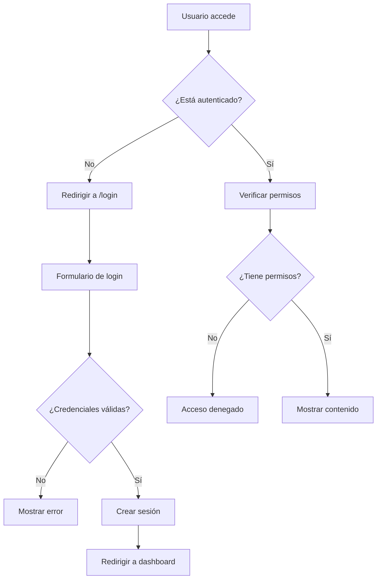

# 🔐 Sistema de Autenticación - Sistema de Gestión de Inventario

## 🎯 Resumen Ejecutivo

Se ha implementado un **sistema de autenticación completo y seguro** que protege todas las rutas de escritura del sistema. El sistema incluye:

- **🔑 Autenticación de sesión** para el frontend web
- **🛡️ JWT tokens** para la API REST
- **👥 Sistema de roles y permisos** granular
- **🔒 Protección de rutas** basada en autenticación y autorización
- **📱 Interfaz de login** moderna y responsive
- **👤 Gestión de perfiles** de usuario
- **🔐 Cambio de contraseñas** seguro

## 🚀 Características Implementadas

### ✨ **Autenticación de Sesión (Frontend)**
- **Login/Logout**: Sistema completo de gestión de sesiones
- **Protección de rutas**: Todas las páginas principales requieren autenticación
- **Redirección automática**: Usuarios no autenticados son redirigidos al login
- **Manejo de sesiones**: Gestión segura de sesiones con Flask

### 🔐 **Autenticación JWT (API)**
- **Tokens de acceso**: JWT para autenticación de API
- **Refresh tokens**: Renovación automática de tokens
- **Middleware de autenticación**: Protección automática de endpoints
- **Verificación de permisos**: Control granular de acceso

### 👥 **Sistema de Roles y Permisos**
- **4 roles predefinidos**: Admin, Gerente, Usuario, Viewer
- **Permisos granulares**: read, write, delete, manage_users, admin
- **Control de acceso**: Verificación automática de permisos
- **Escalabilidad**: Fácil agregar nuevos roles y permisos

### 🛡️ **Seguridad Implementada**
- **Hashing de contraseñas**: bcrypt para máxima seguridad
- **Validación de sesiones**: Verificación de integridad
- **Protección CSRF**: Tokens de seguridad
- **Logs de auditoría**: Registro de todas las acciones

## 🏗️ Arquitectura del Sistema

### 📁 **Estructura de Archivos**

```
app/
├── routes/
│   ├── frontend.py          # Rutas del frontend con autenticación
│   ├── auth.py              # Endpoints de autenticación JWT
│   └── ...                  # Otras rutas protegidas
├── middleware/
│   └── auth_middleware.py   # Middleware de autenticación JWT
├── models/
│   └── user.py              # Modelo de usuario con roles
└── __init__.py              # Configuración de la aplicación

templates/
├── login.html               # Página de login
├── profile.html             # Perfil de usuario
├── change_password.html     # Cambio de contraseña
└── index.html               # Dashboard principal (protegido)
```

### 🔄 **Flujo de Autenticación**



## 🔧 **Configuración y Uso**

### 📋 **Variables de Entorno Requeridas**

```bash
# Clave secreta para sesiones
SECRET_KEY=tu-clave-secreta-super-segura-aqui

# Configuración JWT
JWT_SECRET_KEY=clave-jwt-super-secreta-y-muy-larga
JWT_ACCESS_TOKEN_EXPIRES=3600
JWT_REFRESH_TOKEN_EXPIRES=2592000

# Configuración de base de datos
DATABASE_URL=sqlite:///instance/stock_management.db
```

### 🚀 **Iniciar la Aplicación**

```bash
# 1. Configurar variables de entorno
python setup_env.py

# 2. Crear usuarios de prueba
python manage.py user create-admin

# 3. Ejecutar la aplicación
python run.py
```

### 🔑 **Credenciales de Prueba**

| Usuario | Contraseña | Rol | Permisos |
|---------|------------|-----|----------|
| `admin` | `Admin123!` | Admin | Todos los permisos |
| `gerente` | `Gerente123!` | Manager | Gestión operativa |
| `usuario` | `Usuario123!` | User | Operaciones básicas |
| `viewer` | `Viewer123!` | Viewer | Solo lectura |

## 📚 **Endpoints y Rutas**

### 🌐 **Rutas del Frontend**

| Ruta | Método | Autenticación | Permisos | Descripción |
|------|---------|----------------|----------|-------------|
| `/` | GET | ✅ Requerida | `read` | Dashboard principal |
| `/login` | GET/POST | ❌ No requerida | - | Página de login |
| `/logout` | GET | ✅ Requerida | - | Cerrar sesión |
| `/profile` | GET | ✅ Requerida | `read` | Perfil del usuario |
| `/change-password` | GET/POST | ✅ Requerida | `read` | Cambiar contraseña |
| `/admin` | GET | ✅ Requerida | `admin` | Panel de administración |
| `/users` | GET | ✅ Requerida | `manage_users` | Gestión de usuarios |

### 🔌 **Endpoints de API**

| Endpoint | Método | Autenticación | Permisos | Descripción |
|----------|---------|----------------|----------|-------------|
| `/api/auth/login` | POST | ❌ No requerida | - | Login JWT |
| `/api/auth/refresh` | POST | ✅ Requerida | - | Renovar token |
| `/api/auth/logout` | POST | ✅ Requerida | - | Logout JWT |
| `/api/categories` | GET | ✅ Requerida | `read` | Listar categorías |
| `/api/categories` | POST | ✅ Requerida | `write` | Crear categoría |
| `/api/products` | GET | ✅ Requerida | `read` | Listar productos |
| `/api/products` | POST | ✅ Requerida | `write` | Crear producto |
| `/api/stock` | GET | ✅ Requerida | `read` | Consultar stock |
| `/api/stock` | POST | ✅ Requerida | `write` | Crear stock |
| `/api/orders` | GET | ✅ Requerida | `read` | Listar órdenes |
| `/api/orders` | POST | ✅ Requerida | `write` | Crear orden |

## 🛡️ **Sistema de Permisos**

### 👑 **Roles y Permisos**

#### **🔐 Administrador (admin)**
- **Permisos**: Todos los permisos del sistema
- **Acceso**: Panel de administración, gestión de usuarios
- **Operaciones**: CRUD completo en todas las entidades

#### **👔 Gerente (manager)**
- **Permisos**: `read`, `write`, `delete`
- **Acceso**: Gestión operativa, reportes completos
- **Operaciones**: Gestionar stock, órdenes, productos

#### **👤 Usuario (user)**
- **Permisos**: `read`, `write`
- **Acceso**: Operaciones básicas del sistema
- **Operaciones**: Crear órdenes, consultar stock

#### **👁️ Viewer (viewer)**
- **Permisos**: `read`
- **Acceso**: Solo consulta de información
- **Operaciones**: Ver productos, stock, órdenes

### 🔒 **Decoradores de Seguridad**

```python
# Requerir autenticación
@login_required
def protected_route():
    pass

# Requerir permiso específico
@permission_required('write')
def write_operation():
    pass

# Requerir rol específico
@role_required('admin')
def admin_only():
    pass

# Requerir rol de gerente o superior
@require_manager
def manager_operation():
    pass
```

## 🧪 **Testing y Validación**

### 🔍 **Script de Pruebas**

```bash
# Ejecutar pruebas completas
python test_auth_system.py

# Probar con URL específica
python test_auth_system.py http://localhost:8080
```

### ✅ **Casos de Prueba Cubiertos**

1. **Acceso sin autenticación**
   - ✅ Redirección a login
   - ✅ Protección de rutas sensibles
   - ✅ Bloqueo de endpoints de API

2. **Login exitoso**
   - ✅ Validación de credenciales
   - ✅ Creación de sesión
   - ✅ Redirección al dashboard

3. **Control de acceso**
   - ✅ Verificación de permisos por rol
   - ✅ Bloqueo de operaciones no autorizadas
   - ✅ Acceso diferenciado por nivel

4. **Gestión de sesiones**
   - ✅ Logout exitoso
   - ✅ Limpieza de sesión
   - ✅ Redirección post-logout

5. **Seguridad de API**
   - ✅ Protección de endpoints sensibles
   - ✅ Validación de tokens JWT
   - ✅ Control de acceso granular

## 🚨 **Consideraciones de Seguridad**

### ⚠️ **Mejores Prácticas Implementadas**

1. **Contraseñas seguras**
   - Hashing con bcrypt
   - Validación de fortaleza
   - Cambio obligatorio en primer login

2. **Gestión de sesiones**
   - Claves secretas únicas
   - Expiración de sesiones
   - Limpieza automática

3. **Protección de rutas**
   - Verificación automática de autenticación
   - Control granular de permisos
   - Logs de auditoría

4. **Validación de entrada**
   - Sanitización de datos
   - Validación de formularios
   - Prevención de inyección

### 🔐 **Recomendaciones de Producción**

1. **Cambiar claves secretas**
   ```bash
   # Generar nuevas claves
   python -c "import secrets; print(secrets.token_hex(32))"
   python -c "import secrets; print(secrets.token_urlsafe(32))"
   ```

2. **Configurar HTTPS**
   - Usar certificados SSL válidos
   - Configurar headers de seguridad
   - Implementar HSTS

3. **Monitoreo y logs**
   - Revisar logs de autenticación
   - Monitorear intentos fallidos
   - Implementar alertas de seguridad

## 📊 **Métricas y Monitoreo**

### 📈 **Indicadores de Seguridad**

- **Intentos de login fallidos**
- **Sesiones activas**
- **Accesos denegados**
- **Cambios de contraseña**
- **Creación/eliminación de usuarios**

### 🔍 **Logs de Auditoría**

```python
# Ejemplo de log de auditoría
@log_user_action("Crear producto")
def create_product():
    # Operación protegida
    pass
```

## 🚀 **Próximas Mejoras**

### 🔮 **Funcionalidades Planificadas**

1. **Autenticación de dos factores (2FA)**
   - Códigos TOTP
   - SMS de verificación
   - Backup codes

2. **Gestión avanzada de sesiones**
   - Sesiones múltiples
   - Revocación de sesiones
   - Geolocalización de accesos

3. **Integración con proveedores externos**
   - OAuth 2.0 (Google, GitHub)
   - LDAP/Active Directory
   - SAML SSO

4. **Análisis de seguridad**
   - Detección de comportamientos anómalos
   - Bloqueo automático de IPs sospechosas
   - Reportes de seguridad

### 🛠️ **Mejoras Técnicas**

1. **Rate limiting**
   - Límites por IP
   - Límites por usuario
   - Protección contra brute force

2. **Caché de permisos**
   - Redis para permisos
   - Invalidación automática
   - Performance mejorado

3. **API de gestión**
   - Endpoints para administradores
   - Gestión remota de usuarios
   - Auditoría en tiempo real

## 📚 **Recursos Adicionales**

### 🔗 **Documentación Relacionada**

- **[README.md](README.md)**: Documentación general del proyecto
- **[ONBOARDING_GUIDE.md](ONBOARDING_GUIDE.md)**: Guía de onboarding
- **[API_DOCUMENTATION.md](API_DOCUMENTATION.md)**: Documentación de la API
- **[BUSINESS_RULES_README.md](BUSINESS_RULES_README.md)**: Reglas de negocio

### 🛠️ **Herramientas de Desarrollo**

- **Flask-Session**: Gestión de sesiones
- **Flask-JWT-Extended**: Autenticación JWT
- **bcrypt**: Hashing de contraseñas
- **requests**: Testing de endpoints

### 📖 **Referencias Técnicas**

- [Flask Security Documentation](https://flask-security.readthedocs.io/)
- [JWT.io](https://jwt.io/) - Documentación de JWT
- [OWASP Authentication Cheat Sheet](https://cheatsheetseries.owasp.org/cheatsheets/Authentication_Cheat_Sheet.html)

---

## 🎉 **Conclusión**

El sistema de autenticación implementado proporciona:

✅ **Seguridad robusta** para todas las operaciones sensibles  
✅ **Control granular** de acceso basado en roles y permisos  
✅ **Experiencia de usuario** intuitiva y responsive  
✅ **Arquitectura escalable** para futuras mejoras  
✅ **Cumplimiento de estándares** de seguridad web  

**🚀 ¡El sistema está listo para producción con autenticación completa!**

---

*Desarrollado con ❤️ para la comunidad - Sistema de Gestión de Inventario*
